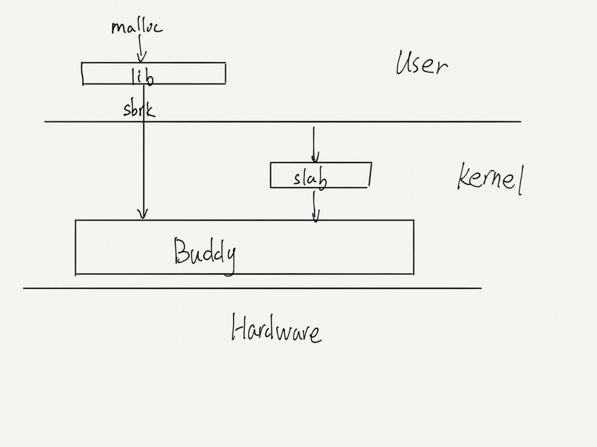
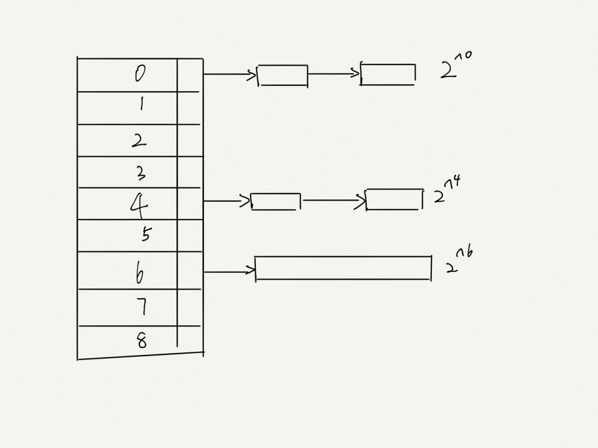

<!--
backgroundImage: url('assets/bg-lead.png')
-->

# xv6-rust 设计报告
Ko.oK  

---
## Outline
- 设计简介
- 为什么使用Rust？
- 设计实现
- 总结与展望
- 参考
---
## 设计简介
xv6-rust 是使用对MIT xv6-riscv 项目的重新设计与实现。这次实验既可以看做 Rust 语言在 OS 方向上的探索，也可以看做高校在 OS 课程上的实践作业.
在实现中我们充分利用了 Rust 的各种特性，并根据 Rust 特性适当对于 xv6-riscv 的设计进行修改.

---
## 为什么使用Rust？

- Ownership
- Borrow
- Smart Pointer
- Unsafe
- Trait
- Alloc
- Crate

---

## 设计实现
- Static Variable
- Ownership
- SpinLock & SleepLock & RAII
- Process
- Memory
- File System
- Trap
---
## Static Variable
在Rust中，静态变量在编译之后就拥有了精确的内存地址，这就意味着不能在运行时为静态变量进行地址空间的分配。同样一件事，在C语言中可以将其作为全局变量声明，之后在程序运行时再对其进行初始化，然而这在Rust语言中是不允许的。因此我们对于特定类型的变量都要为其提供 `new()` 方法进行初始化；对于需要在堆上分配的变量，需要使用 `lazy_static!` 宏对其进行懒加载从而实现动态内存分配.

---
## Ownership
### 所有权
所有权机制默认使用移动语意，它保证在同一个生命周期内只能有一个可变引用和多个不可变引用，这样可以极大程度上保证了内存安全，不会出现悬空指针等情况.
然而，Rust 的所有权机制也会在一定程度上限制了程序员的发挥.
例如，当我们实现 `alloc_proc`时就会遇到一些问题,以下为我们最初的实现：

---
```rust
pub fn alloc_proc(&mut self) -> Option<&mut Process> {
        for p in self.proc.iter_mut() {
            let mut guard = p.data.acquire();
            if guard.state == Procstate::UNUSED {
                .
                // An empty user page table
                if let Some(page_table) = unsafe { extern_data.proc_pagetable() } {
                    .
                } else {
                    p.freeproc();
                    drop(guard);
                    return None
                }
            }else {
                p.freeproc();
                drop(guard);
            }
        }
    	None
    }
```
---
可以看到，在最初的实现中，我们首先遍历调度器内部所有的进程，然后找到一个状态为未使用的空进程，并为它分配页表，如果失败的话就释放它.
但是由于此时在if与else等多个代码块中同时持有了对于当前进程 `p` 的可变引用，这在rust的编译器中是不被允许的，所以rust编译器不予通过.
因此，我们选择通过修改 `proc_pagetable()` 函数使其在内部进行检查是否分配成功，当失败时调用 `freeproc()` 释放页表的物理内存分配. 这样的话就在一个生命周期中仅仅持有一个可变引用.

---
修改后的代码如下：
```rust
pub fn alloc_proc(&mut self) -> Option<&mut Process> {
        for p in self.proc.iter_mut() {
            let mut guard = p.data.acquire();
            if guard.state == Procstate::UNUSED {
              .
                // An empty user page table
                unsafe{
                    extern_data.proc_pagetable();
                }
               	.
            }else {
                drop(guard);
            }
        }
        None
    }
```

---
## SpinLock & SleepLock & RAII
在 `xv6-riscv` 中，对于需要需要上锁的数据结构，仅仅在其域中放入 `lock` 的指针. 而在获取锁的过程中，仅仅针对 `lock` 的指针来判断是否可以上锁. 然而这种写法对于程序员的要求很高，因为这样依然可以在不获取锁的情况下依然读取数据结构的内容；或者由于程序员由于忘记去释放锁从而导致死锁，例如：
```c
struct {
  struct spinlock lock;
  struct run *freelist;
} kmem;
```
在C里仅仅使用一个 `spinlock` 的数据结构来表明上锁.

---
而 Rust 具有较为完善的类型系统，支持泛型. 因此我们可以将锁设计为智能指针的形式，将具体的变量内容包裹在锁的内部，当我们获取锁的时候返回一个守卫变量，在变量中可以访问并修改变量内部的域.
除此之外，由于 Rust 拥有 `Drop` 的特性，因此只要我们为我们的锁实现了 `Drop` 特性，当变量离开作用域时会自动释放锁，在真正意义上实现了 `RAII`. 从而避免了死锁的发生.   

例如：
```rust
pub struct KernelHeap(Spinlock<BuddySystem>)
```
---
### 自旋锁
自旋锁的简略实现如下所示： 

```rust
    pub fn acquire(&self) -> SpinlockGuard<'_, T> {
        push_off();
        .
        while self.locked.swap(true, Ordering::Acquire){ spin_loop(); }
        .
        SpinlockGuard{spinlock: &self}
    }
       pub fn release(&self) {
         .
        self.locked.store(false, Ordering::Release);
        pop_off();
    }
```
---
自旋锁使用 CAS(Compare And Swap) 来实现，自旋锁通过原子变量的内存排序来判断是否可以上锁，倘若不可以上锁则保持忙等待的状态. 除此之外也可以注意到，在上锁与解锁中间，伴随 `push_off` 和 `pop_off` 的操作，防止在上锁过程中发生了外部中断而造成死锁.

### 睡眠锁
睡眠锁同自旋锁不同，自旋锁通过 CAS 来实现. 而睡眠锁除了使用自旋锁保护睡眠锁之外，同时需要调用当前进程的 `sleep` 使其休眠并进入调度器进行调度，当调度后则释放自旋锁.
使用自旋锁来保护的原因是我们可以确保我们将不会错过任何一次 `wake_up` 来唤醒被休眠的进程. 当睡眠锁解锁之后，也需要将自旋锁上锁并调用 `wake_up` 方法来唤醒被休眠的进程，之后释放自旋锁.

---
## Process
在 `xv6-riscv` 的实现中，进程仅用一个数据结构来描述. 其中的一些域需要上锁来访问，有些内容则不需要上锁访问. 对于 C 语言来说，当访问需要上锁的数据可以直接调用 `spinlock` 的 `acquire` 来访问，而对于不需要上锁的数据可以直接访问.
而对于 Rust 来说，如果使用 `Spinlock` 来包裹 `Process` 结构，那么就会导致无法区分这些数据的区别，从而导致访问很多数据的性能低下.
因此我们可以选择把 `Process` 分成不同的 field 来实现:
```rust
pub struct Process {
    pub data: Spinlock<ProcData>,
    pub extern_data: UnsafeCell<ProcExtern>,
}
```
---
## Memory
### 内存分配系统

由于 Rust 有 `alloc` 特性，提供了内存分配的 API. 在提供了标准库的程序中都会有一个全局的内存分配器来进行内存分配，而在 `no_std` 的环境下，只要我们实现了 `alloc` 特性并提供了全局的内存分配器，我们就可以使用 `Box` 或者 `Vec` 等智能指针. 在我们的实现中，在 **内核态** 和 **用户态** 分别使用了不同的算法来实现.

内存分配的架构图如下：

---


---
**内核态**
在内核态中，我们使用 **伙伴内存分配系统** 来实现。伙伴内存分配系统主要作用是为了减少内存的浪费，例如要分配一块大的内存，使用传统的链式内存分配只能寻找一块足够大的内存来分配，这时中间有很多小块的内存会被忽略，这时就会造成内存的浪费。

在伙伴内存分配系统中，每次分配的内存字节数都必须是 2 的整数幂，范围大小可以自由设置。不同大小内存的空闲块分别管理.

其中，`Buddy System` 是以页为基准来分配的（即最少为 4096 bytes）。而对于每页中的内存则需要使用 `slab` 来分配。其中，我们需要为每一页维护一张位图，每页维护当前内存是被分配或者被分割成更小的块。

---

在为给定的 Layout 分配内存时，首先需要将该 Layout 的 size 与 2 的整数幂进行对齐，然后遍历对应 size 链表，若发现空闲内存则返回对应的指针，否则则遍历更大 size 的链表进行寻找空闲块。

当回收内存时，我们需要根据给定的 Layout 发现对应的地址和大小，根据其分配情况或者直接释放内存 push 到原来的内存链表中或者进行合并后再次 push。 

以下为我们实现 `Buddy System` 细节的详细介绍：

---

```rust
pub struct BuddySystem {
    initialized: bool,
    base: usize,            // the starting addr managed by the buddy system
    actual_end: usize,      // the actual end addr managed by the buddy system
    nsizes: usize,          // the number of different sizes of blocks
    leaf_size: usize,
    max_alignment: usize,
    infos: MaybeUninit<*mut [BuddyInfo]>,
}

/// Buddy info for block of a certain size k, k is a power of 2 
#[repr(C)]
struct BuddyInfo {
    free: List,                         // record blocks of a certain size
    alloc: MaybeUninit<*mut [u8]>,      // tell if a block is allocated
    split: MaybeUninit<*mut [u8]>,      // tell if a block is split into smaller size
}
```

---
本来这里有一段很长的代码，可惜这里的空白处太小，写不下😅.

简单来说，我们的 `alloc` 通过从小至大遍历空闲链表，从中找到一块空闲块. 如果空闲块的大小大于待分配的内存大小，则将其不断分割成更小的块至待分配的内存大小，同时递归地更新每个被重新分配和分割的链表信息和位图信息.

而 `dealloc` 方法则反其道而行之，通过给定的 `Layout` 信息，根据地址找到对应的块和分配情况，从下至上合并空闲块并更新链表和位图信息.

以下为 `Buddy System` 的示意图：

---


---
**用户态**
在用户态中，我们使用 `sys_sbrk` 系统调用为用户进程来分配内存，而 `sys_sbrk `则使用 `Buddy System` 来分配内存。因此在用户态我们只需要实现一个双向链表来管理每次系统调用分配的内存即可。每次系统调用分配内存后，我们都将在分配指针的头部记录当前分配的信息，并将可用的内存指针向后移 `size_of::<Frame>()` 大小，并将其加到所维护的链表的尾部。

当用户程序需要分配内存时，我们将遍历链表发现一块足够大小的内存，若该块内存大小和所要分配的内存大小正好相等则将其从链表中 `pop` 出来。否则我们将对应的头部信息向后移所要分配的内存大小，修改头部信息，并返回内存指针。

----

当用户程序释放内存时，我们根据 Layout 的信息获取其指针和大小。当改内存块仍然在链表中则移动头部指针位置修改头部信息。若该内存块已经被移出链表，我们可以根据对应的头部信息将其重新加到链表对应的位置中。

**栈的改进**
由于在 `xv6-riscv` 中的内核栈的大小为 4KB（即1页）。但4KB的大小对于某些进程来说是不够的，因此我们统一将每个进程的栈大小设置为 16KB（即4页）。当我们为每个进程映射栈内存时，需要分配5页，其中4页用来进行栈内存的映射，而最后一页则不进行映射，对于内核进行保护，当进程爆栈后会由于访问被保护的页而被强行终止而不会造成安全漏洞。

---
## File System
- Inode 的设计（参考 xv6-riscv-rust）

在 `xv6-riscv` 的设计中，`inode struct` 为 `inode`  在内存中的拷贝，只有获取其睡眠锁之后，我们才能够获得在磁盘上存储的inode的信息。

根据我们之前设计的经验，我们应当为 `SleepLock<Inode>` 类型实现 `lock` 方法，这样理论上是可行的，但是却是很不方便的。例如，在抽象文件的设计中，我们需要存储为 `Option<Inode>` 的内容，而带上睡眠锁后处理起来也很不方便。除此之外，`inode` 的一些信息不需要上锁也可以读取，这样就涉及到分 `field` 来设计，因此设计成 `SleepLock<Inode>` 的做法是不明智的。

--- 

在我们的设计中，把获取锁前和获取锁后的数据进行分别处理，获取锁前的数据称为元数据，获取锁后为真实存储在磁盘上的数据。其中，当元数据执行获取操作时，我们根据元数据的 id 获取全局 `InodeCache` 对应的缓存数据，根据缓存数据是否为脏数据来进行刷新，并返回已经被上锁的磁盘数据。同样地，当我们对 inode 进行解锁时，我们充分利用了 rust 的 `Drop` 特性，当 `InodeData` 的生命周期结束或者手动销毁时，`InodeCache` 会自动执行 `put` 方法检查 inode 是否应当被回收。

- Device 的设计

在 `xv6-riscv` 的设计中，在设备表中的每个结构体中都有读与写两个方法。而在我的实现中则选择使用两个指针来代替，指针指向对应的设备的读与写方法，当调用时转换为对应的方法。

--- 

- 块缓冲区的设计

在  `xv6-riscv` 中，块缓冲区的设计使用双向链表来实现，我们需要将不同的域分开来实现，这样可以尽可能避免所有权带来的编译问题. 其中，`BCache` 分为 LRU 和 Buf 两个域，其中 Buf 则为缓冲区内存储的全部内容，而 LRU 则使用 LRU 替换算法来读取，其中 LRU 分别有 `prev` 和 `next` 两个指针，分别指向前后块设备的元数据指针.

而 `Buf` 结构体则是对于缓冲区原始数据的包裹，这是缓冲区数据在更加底层的抽象，在此结果上的修改可以写回磁盘上的数据。在我们的实现中，缓冲区队列可以通过元数据（即设备号或者块号）来获取对应的块缓冲区内容，同时，在获取块缓冲区内容的时候涉及到为对应的缓冲区数据上睡眠锁（即磁盘上的内容在内存中的直接拷贝）. 同时，在释放锁时需要修改 LRU 的对应顺序以及检查和写回到原始磁盘上.

---
## Trap
在原版 `xv6-riscv` 中，对于内核中断信息给出的信息较少，仅仅给出了`scause`、`sepc`、`sscause`等寄存器的值，具体的中断类型还需要去查看RISC-V来确定。因此我们参考 `rust-embedded/riscv` 的实现为我们寄存器做了优化。

在我们的中断的实现中，主要根据 `scause` 寄存器中读出的值进行了解析。其中，根据 `scause` 的最高位不同可以将其区分成异常和中断两种类型，而根据其低位又可以将其区分不同的异常和中断类型。

---
## 总结与展望
### 总结
- 实现了 `xv6-riscv` 内核到 Rust 上的移植
- 熟悉了如何使用 Rust 编写 OS 以及调试方法
- 实现了 `Buddy System Allocator`
- 实现了部分网络协议

---
### 未来展望
- 继续添加用户程序进行测试
- 实现网络协议栈，使之可以收发网络分组
- 移植 `RustSBI` 到本项目中
- 将本项目可以运行在 `K210` 上

---
## 参考
- [xv6-riscv](https://github.com/mit-pdos/xv6-riscv)
- [xv6-riscv-rust](https://github.com/Jaic1/xv6-riscv-rust)
- [rCore-Tutorial-v3](https://github.com/rcore-os/rCore-Tutorial-v3)
- [book-riscv-rev1](https://pdos.csail.mit.edu/6.828/2020/xv6/book-riscv-rev1.pdf)
- [PCI/PCI-X Family of Gigabit Ethernet Controllers Software Developer's Manual](https://pdos.csail.mit.edu/6.S081/2020/readings/8254x_GBe_SDM.pdf)
- [rCore-Tutorial-Book 第三版](https://rcore-os.github.io/rCore-Tutorial-Book-v3/index.html)

---
<style scoped>
h1 {
  margin-top: 15%;
  font-size: 100pt;
}
</style>
# 谢谢大家!


